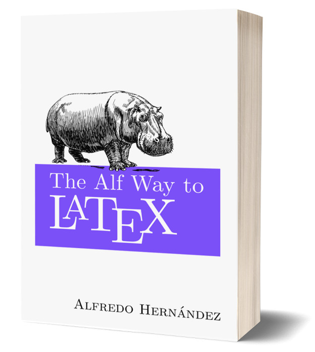

There are many good books to learn LaTeX, like *LaTeX and Friends* by Marc R. C. van Dongen (my favourite) or the [*LaTeX Guide*](https://en.wikibooks.org/wiki/LaTeX) from Wikibooks. But sometimes you find that they go either too deep into technical details, or they don't really scratch the surface of what LaTeX can offer.

That's why I decided a couple of weeks ago to write my own book about LaTeX. My approach is not academic or technical, just a (I think) simple introduction to LaTeX, what it offers, and how you can use it in clever ways to ease your work (specially in Mathematics and Physics). Some of the best tips and black magic I use daily comes straight from [TeX - LaTeX Stack Exchange](https://tex.stackexchange.com/) (special mentions to the amazing [Enrico Gregorio](https://tex.stackexchange.com/users/4427/egreg)).

Without further ado, let's present the name of the book: *The Alf Way to LaTeX*, a rather bombastic but silly at the same time, so of course, I'm very proud of it.

Overall, the goal of my book is to create a somehow weird short (I hope) book about the things you cannot and will not find in most books, and of course, to have fun writing it.

I'm not entirely sure about the structure of the chapters yet, but I think I have a good general idea of what I want to put on it.

