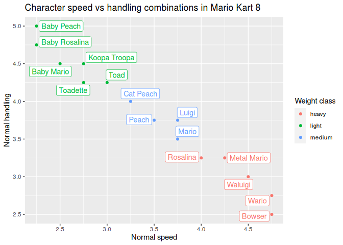
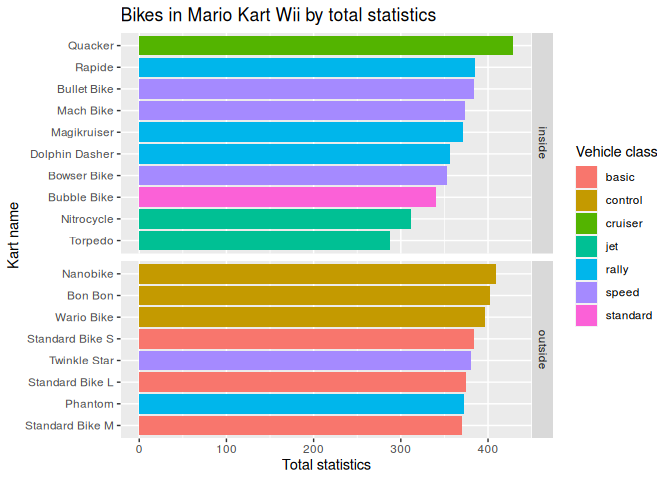

{}
  [](https://www.tidyverse.org/lifecycle/#maturing)
  [](https://cran.r-project.org/package=mariokart)
  [](https://aldomann.github.io/mariokart/)
{}


Mario Kart character and vehicle statistics datasets from different games of the series.

Currently these entries have been implemented:

  - Super Mario Kart (`smk_acceleration`, `smk_characters`, `smk_speeds`)
  - Mario Kart Wii (`mkwii_characters`, `mkwii_vehicles`)
  - Mario Kart 8 (`mk8_characters`, `mk8_vehicles`, `mk8_wheels`,
    `mk8_gliders`)

## Installation

<!-- You can install the released version of mariokart from [CRAN](https://CRAN.R-project.org) with: -->

<!-- ``` r -->

<!-- install.packages("mariokart") -->

<!-- ``` -->

<!-- And  -->

You can install the development version from [GitHub](https://github.com/) with:

``` r
# install.packages("devtools")
devtools::install_github("aldomann/mariokart")
```

## Examples

This is an example which shows how to visually compare statistics from different Mario Kart 8 characters:

``` r
library(mariokart)
library(ggplot2)
library(dplyr)
```

``` r
data(mkwii_characters)
data(mk8_vehicles)

mk8_characters %>%
  group_by(speed_normal, handling_normal, weight_class) %>%
  slice(1) %>%
  ggplot() +
  aes(x = speed_normal, y = handling_normal, color = weight_class, label = character) +
  ggrepel::geom_label_repel(seed = 1, show.legend = FALSE) +
  geom_point() +
  scale_x_continuous(breaks = seq(2, 5, 0.5)) +
  labs(
    title = "Character speed vs handling combinations in Mario Kart 8",
    x = "Normal speed",
    y = "Normal handling",
    color = "Weight class"
  )
```



This is an example which shows how to visually compare Mario Kart Wii karts statistics grouped by drifting type:

``` r
data(mkwii_vehicles)

mkwii_vehicles %>%
  filter(vehicle_type == "bike") %>%
  mutate(total_stats = rowSums(select_if(., is.numeric))) %>%
  select(starts_with("vehicle"), drift_type, weight_class, total_stats) %>%
  arrange(vehicle_class) %>%
  ggplot() +
  aes(x = reorder(vehicle, total_stats), y = total_stats, fill = vehicle_class) +
  geom_col() +
  labs(
    title = "Bikes in Mario Kart Wii by total statistics",
    x = "Kart name",
    y = "Total statistics",
    fill = "Vehicle class"
  ) +
  facet_grid(drift_type ~ ., scales = "free_y", space = "free_y") +
  coord_flip()
```



This is an example which shows a visual comparison of the best characters per weight class in Mario Kart Wii:

``` r
data(mkwii_characters)

mkwii_characters %>%
  select(-weight) %>%
  mutate(total_stats = rowSums(select_if(., is.numeric))) %>%
  arrange(desc(total_stats)) %>%
  group_by(weight_class) %>%
  mutate_at(
    vars(-character, -weight_class, -total_stats),
    function(x) {x/10}
  ) %>%
  slice(1) %>%
  ungroup() %>%
  select(-weight_class, -total_stats) %>%
  ggradar::ggradar(
    grid.label.size = 5,
    group.point.size = 4,
    group.line.width = 1,
    axis.labels = c("Speed", "Acceleration", "Handling", "Drift", "Off-road", "Mini-turbo"),
    axis.label.size = 4.5,
    legend.text.size = 12
  )
```


A graph showing the speed as a function of time when accelerating from a
standstill with various characters in Super Mario Kart:

``` r
data(smk_acceleration)

smk_acceleration %>%
  filter(character %in% c("Mario", "Peach", "Toad", "Bowser")) %>%
  ggplot() +
  aes(x = time, y = speed, group = character, color = character) +
  geom_line() +
  geom_point() +
  scale_x_continuous(breaks = seq(0, 8, 1)) +
  scale_y_continuous(breaks = seq(0, 140, 20)) +
  labs(
    title = "Speed as a function of time for various characters in Super Mario Kart",
    x = "Time (s)",
    y = "Speed (km/h)",
    color = "Character"
  )
```


